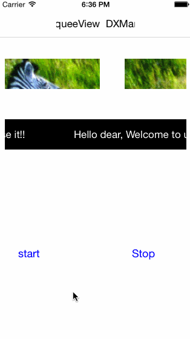

DXMarqueeView
=============

###How to use

	//step 1, new a DXMarqueeView
	self.imageMarqueeView = [[DXMarqueeView alloc] initWithFrame:CGRectMake(10, 100, 300, 50)];
	
	//step 2, new your target view, here is an imageView
	UIImageView *imageV = [[UIImageView alloc] initWithImage:[UIImage imageNamed:@"horse.png"]];

	//step3, set marqueeView's viewToScroll to be your target View 
	self.imageMarqueeView.viewToScroll = imageV;
	
	//setp4, began to scroll, if yes means left, no means right
	[self.imageMarqueeView beginScrollingToLeft:YES];
	
	[self.view addSubview:self.imageMarqueeView];

###Credits

Improved from [DVOMarqueeView](https://github.com/mobitar/DVOMarqueeView).

Two things I improved:

1. Support iOS 7.0 and **earlier** because the code from "DVOMarqueeView" `snapshotViewAfterScreenUpdates:` supports only above iOS7.0 and later. Here, we use the `[NSKeyedUnarchiver unarchiveObjectWithData:[NSKeyedArchiver archivedDataWithRootObject:viewToScroll]]` instead to do the copy UIView work. 
2. Support right scroll orientation.

###Demo

The real thing is more smooth.

